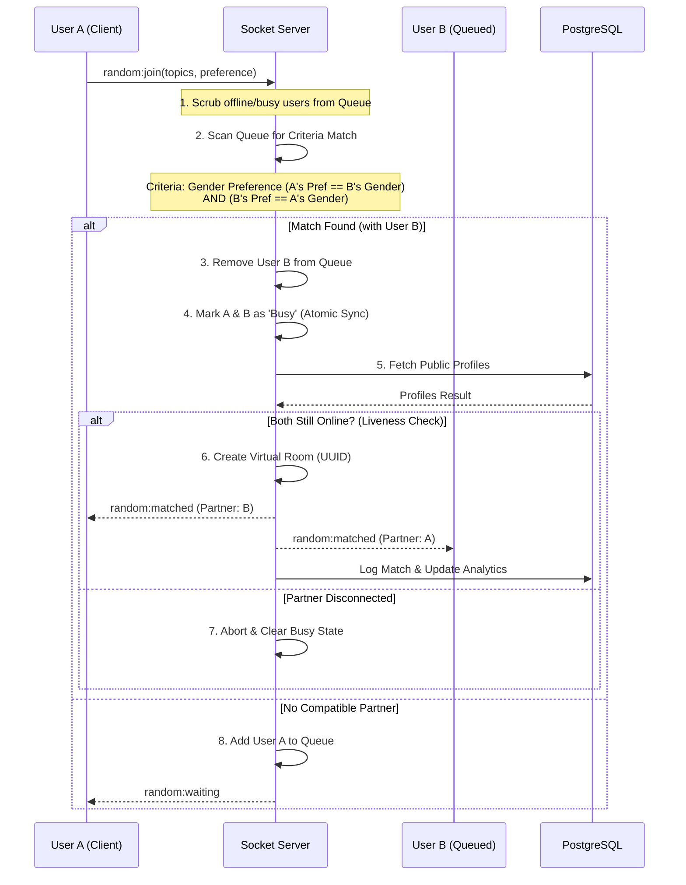

# MushDikhai - Matching System Architecture

MushDikhai uses a robust, real-time matching system built on **Socket.io** and **Node.js**. It is designed to handle high concurrency, multi-tab sessions, and privacy-focused identity matching.

## 🛠 Matching Flow Architecture

The matching system operates on a "Mutual Satisfaction" principle. A match is only created if **both** participants' criteria are met.

### Sequence Diagram

---

## 🏗 Key Components

### 1. Robust Queue Management
- **In-Memory Queue**: Fast matching using a standard JavaScript array (`randomQueue`).
- **Scrubbing**: The server automatically removes users from the queue if they go offline or get matched elsewhere during the scan. This ensures User A never tries to match with a "ghost" user.

### 2. Multi-Tab Session Stability
- **Active Socket Tracking**: Uses a `Map<string, Set<string>>` to track every open tab for a user.
- **Protection**: Cleanup logic (leaving rooms, ending matches) only triggers when the **last** tab for a user is closed. Users can refresh or open multiple tabs without breaking their active chat.

### 3. Mutual Satisfaction Matching
- **Gender Preferences**: Matches respect identity boundaries (`Everyone`, `Male`, `Female`).
- **Topic Overlap**: If multiple partners satisfy gender criteria, the system prioritizes those sharing the same conversation topics.

---

## 🔒 Security & Performance
- **Atomic Locking**: Users are marked as "Busy" the millisecond a match is found, preventing a third user from stealing a partner during the asynchronous profile fetching phase.
- **Liveness Guard**: An extra check is performed after database calls to ensure no network jitter caused a disconnect during the matching handshake.
- **Ephemeral Rooms**: Random chat rooms exist only in memory; they are automatically purged upon the last user leaving to maintain privacy.

---

## 💻 Code Reference
The matching logic is primarily located in:
- `PlasticWorld/src/config/socket.ts`: Core Matching Engine.
- `product-website/src/components/Home.jsx`: Preference Selection UI.
- `product-website/src/App.jsx`: State Orchestration.
