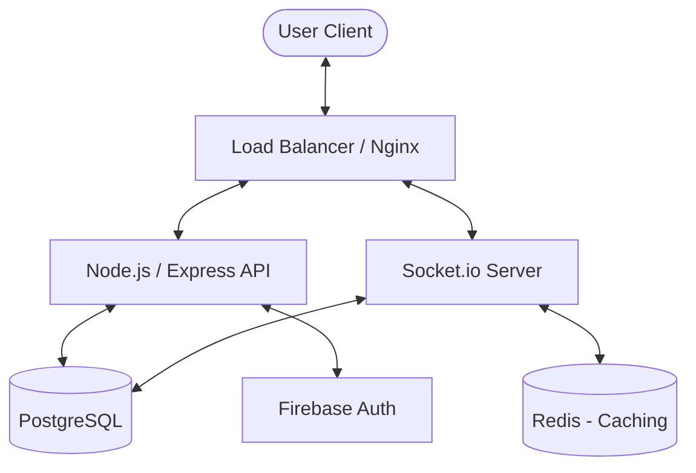
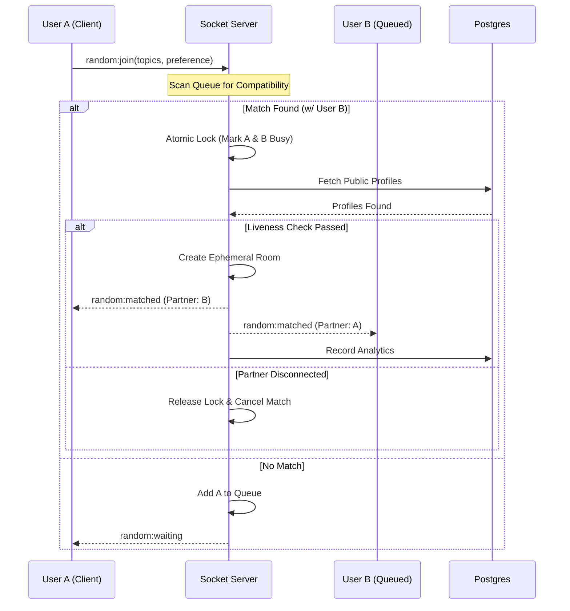
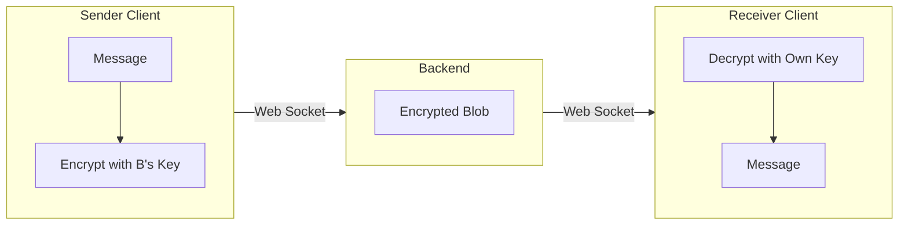

# MushDikhai: A Premium Real-Time Interactive Platform

MushDikhai is a sophisticated, real-time communication platform designed for seamless connectivity, high privacy, and premium user experience. It leverages a modern tech stack to provide both random matching and friend-based interactions with end-to-end encryption.

---

## 🏛 System Architecture Overview

The system is split into a high-performance Node.js backend (`PlasticWorld`) and a modern React frontend (`product-website`). Communication is handled via REST APIs for persistent data and Socket.io for all real-time interactions.

### High-Level Architecture


---

## � Key Modules & Functions

### 1. The Matching Engine (Robust Random Chat)
The matching system uses a "Mutual Satisfaction" handshake. It scans a global queue of waiting users and only connects them if **both** participants' gender preferences and topic interests align.

**Logic Highlights:**
- **Queue Scrubbing**: Automatically removes offline/busy users during every match attempt.
- **Sync Locking**: Instantly marks users as "Busy" to prevent race conditions during high concurrency.
- **Multi-Tab Safety**: Tracks active sockets per user; session state only clears when the user disconnects their *last* open tab.

#### Matching Sequence


---

## 🔐 Security & Privacy

### End-to-End Encryption (E2EE)
MushDikhai ensures that messages between friends are encrypted on the client side before hitting the server.
- **Key Exchange**: Uses Diffie-Hellman or pre-shared keys managed via `encryption.service.ts`.
- **Vanish Mode**: Messages can be sent in 'Vanish Mode', which are automatically purged from both clients and memory after being read.

### Data Security Flow


---

## 📱 Frontend Ecosystem

The frontend is a visual-first React application focusing on "Rich Aesthetics" and "Dynamic Transitions."

**Core Components:**
- **Onboarding**: Multi-step flow for identity (Gender) collection and avatar selection.
- **Home Hub**: Topic selection, live presence tracking, and matching controls.
- **Chat Interface**: Supports replies, reactions, media uploads, and real-time typing indicators.

---

## � Project Structure

```bash
├── PlasticWorld/              # Backend Services
│   ├── src/
│   │   ├── config/           # Database, Socket, Redis config
│   │   ├── migrations/       # SQL Schema evolutions
│   │   ├── routes/           # REST API endpoints
│   │   ├── services/         # Business logic (User, Match, Message)
│   │   └── utils/            # Shared helpers & Loggers
├── product-website/           # Frontend Application
│   ├── src/
│   │   ├── components/       # UI Components (Chat, Home, Profile)
│   │   ├── hooks/            # Custom React hooks (WebRTC, Sockets)
│   │   └── assets/           # Styles & Media
└── README.md                  # This documentation
```

---

## 🛠 Tech Stack

| Layer | Technology |
| :--- | :--- |
| **Frontend** | React, Vite, Vanilla CSS (Premium Themes) |
| **Backend** | Node.js, TypeScript, Express |
| **Real-time** | Socket.io |
| **Database** | PostgreSQL |
| **Auth** | Firebase Authentication |
| **P2P Video/Audio** | WebRTC |

---

## � Future Roadmap
1. **AI Moderation**: Real-time content filtering for safe chat environments.
2. **Encrypted Media**: Extending E2EE to image and video uploads.
3. **Presence 2.0**: Visualized 3D space for waiting users.
