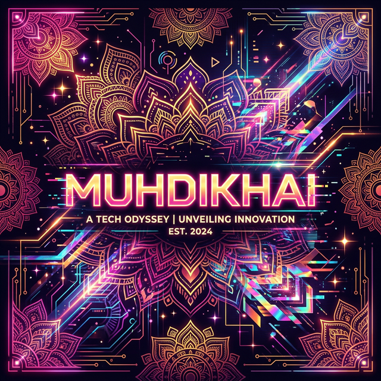
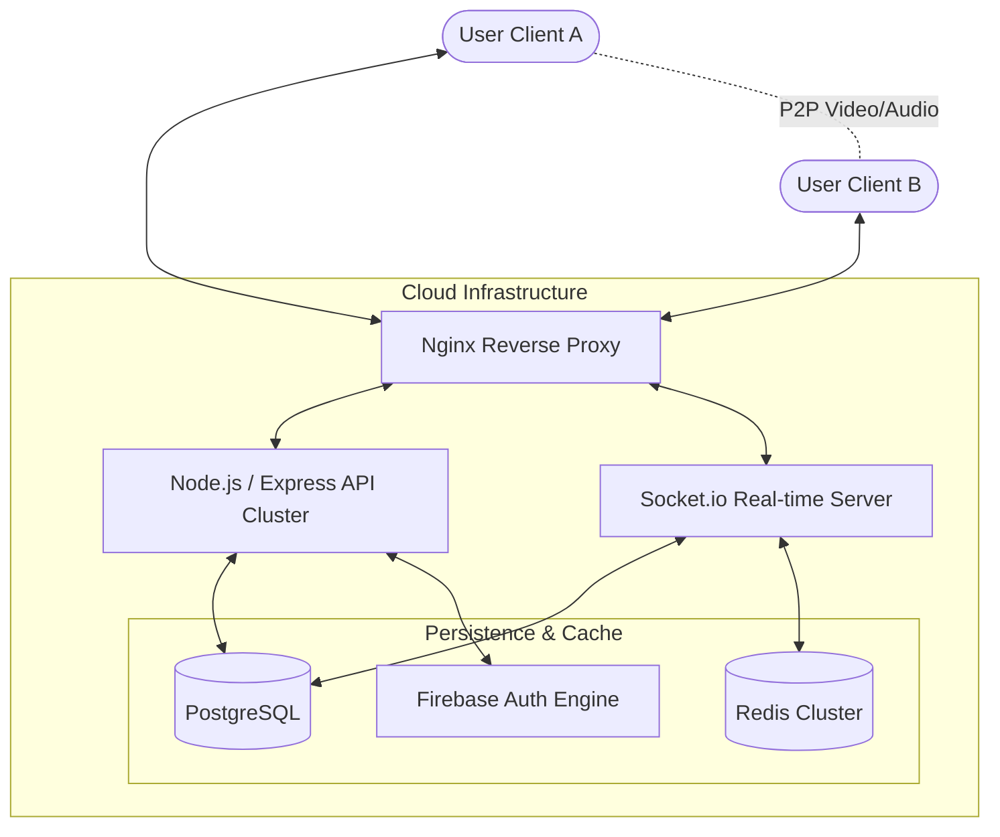
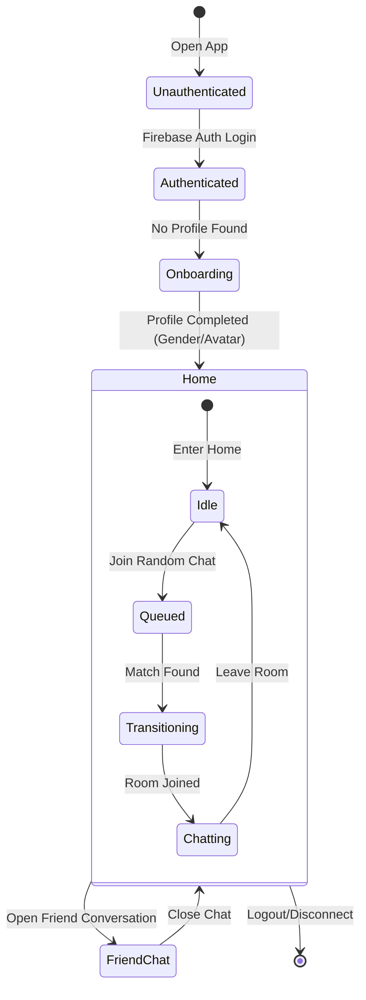
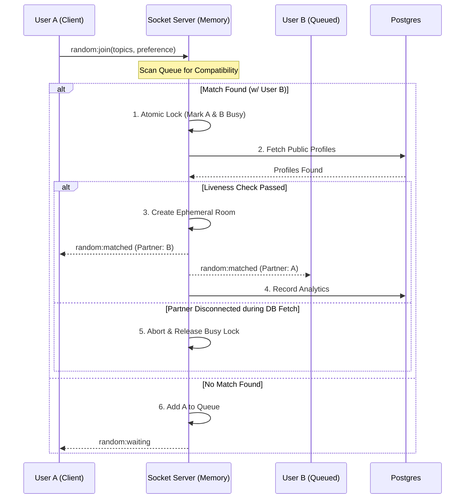
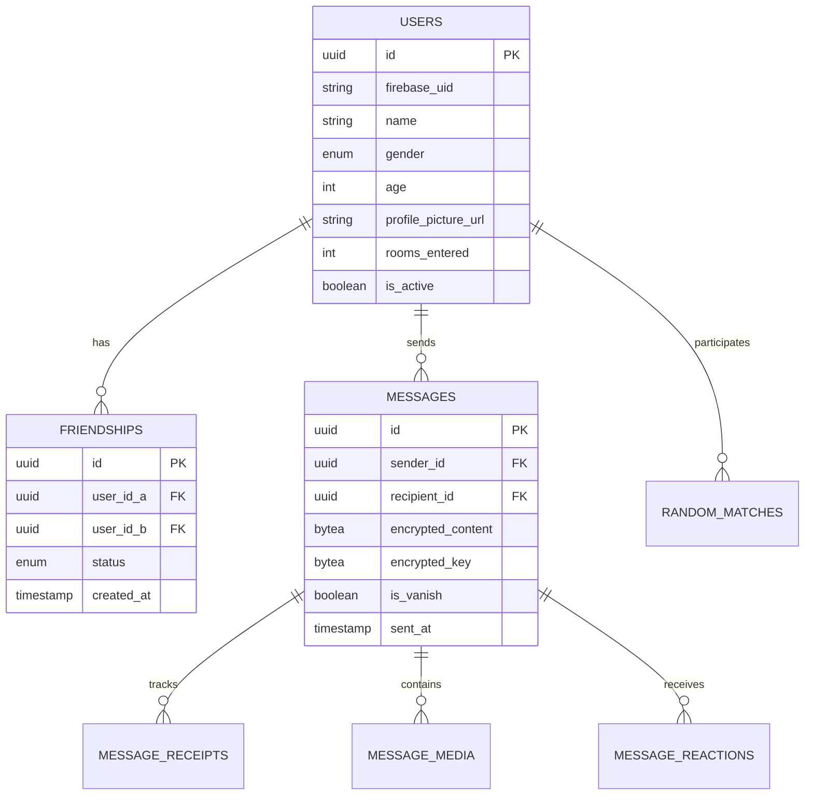
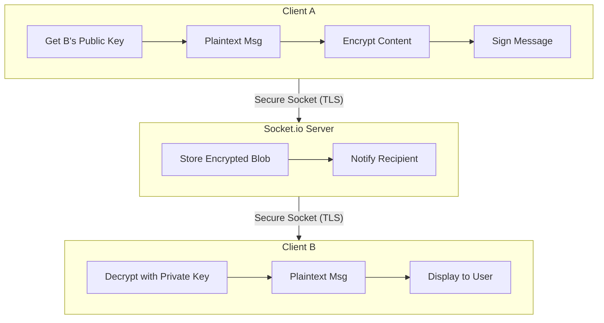
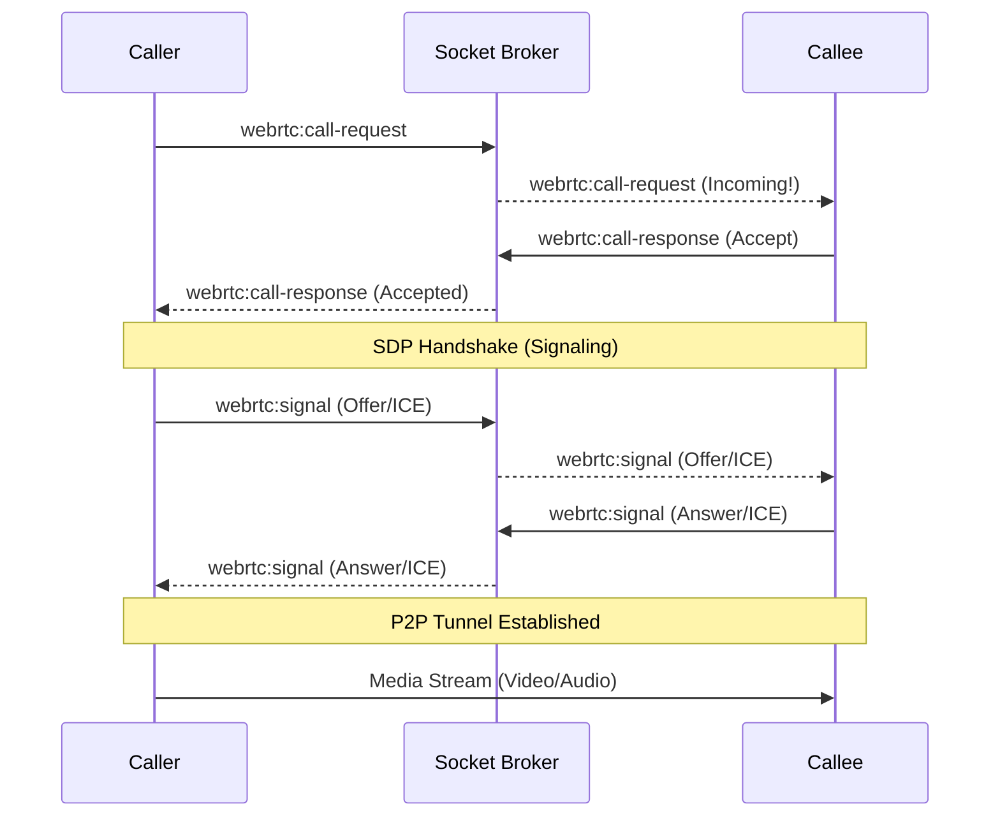
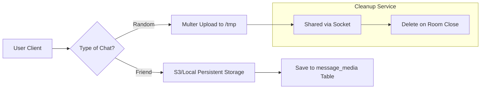
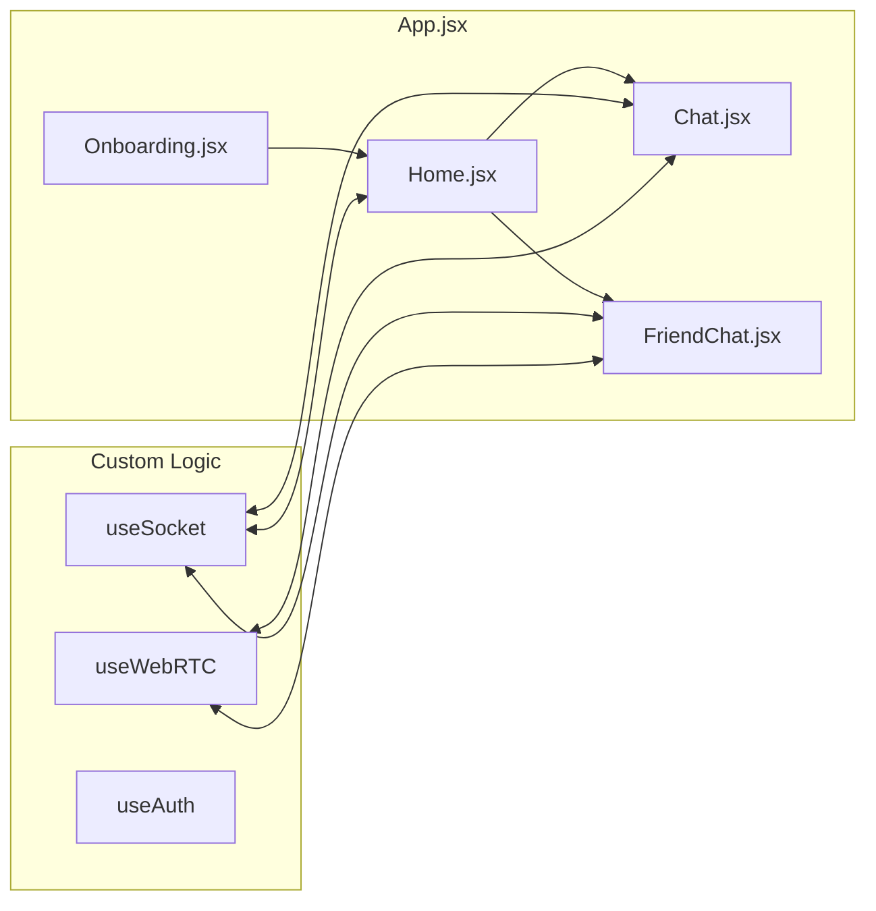

# <p align="center">  </p>

<h1 align="center">MUHDIKHAI</h1>
<p align="center">
  <strong>Real People. Pure Chaos. Total Privacy.</strong><br>
  <i>A premium, Indian-Maximalist random chat experience built for the bold.</i>
</p>

<p align="center">
  
  
  
  
</p>

---

## 🎭 The Philosophy: "Gayi Bhains Paani Mein"
Muhdikhai (unveiling) is designed with the philosophy that once a conversation is over, it should be truly *gone*. No long-term logs for strangers, no snooping, just raw interaction. We combine the thrill of random encounters with the security of high-end encryption.

### 🌟 Core Highlights
- **💨 Ephemeral Random Chat:** Zero storage for stranger interactions. Shredded on room exit.
- **🔐 Friend Crypt:** End-to-End Encrypted (E2EE) messaging for your close circle.
- **✨ Vanish Mode:** Messages that self-destruct in 10 seconds.
- **🧿 Aura System:** Community-driven reputation (Vibe Checks) to isolate toxicity.
- **🎥 WebRTC Video:** Crystal clear P2P video calls without server-side recording.
- **🎨 Scratch Pad:** Collaborative doodle boards to let the chaos flow.

---

# <p align="center">  </p>

<h1 align="center">MUHDIKHAI</h1>
<p align="center">
  <strong>Real People. Pure Chaos. Total Privacy.</strong><br>
  <i>A premium, Indian-Maximalist random chat experience built for the bold.</i>
</p>

<p align="center">
  
  
  
  
</p>

> [!IMPORTANT]
> **PROPRIETARY SOFTWARE:** This project is private property. It is NOT open-source. Unauthorized access, cloning, distribution, or reverse-engineering is strictly prohibited.

---

## 🎭 The Philosophy: "Gayi Bhains Paani Mein"
Muhdikhai (unveiling) is designed with the philosophy that once a conversation is over, it should be truly *gone*. No long-term logs for strangers, no snooping, just raw interaction. We combine the thrill of random encounters with the security of high-end encryption.

### 🌟 Core Highlights
- **💨 Ephemeral Random Chat:** Zero storage for stranger interactions. Shredded on room exit.
- **🔐 Friend Crypt:** End-to-End Encrypted (E2EE) messaging for your close circle.
- **✨ Vanish Mode:** Messages that self-destruct in 10 seconds.
- **🧿 Aura System:** Community-driven reputation (Vibe Checks) to isolate toxicity.
- **🎥 WebRTC Video:** Crystal clear P2P video calls without server-side recording.
- **🎨 Scratch Pad:** Collaborative doodle boards to let the chaos flow.

---

## 🏛 System Architecture Overview

The system is split into a high-performance Node.js backend (`PlasticWorld`) and a modern React frontend (`product-website`). Communication is handled via REST APIs for persistent data and Socket.io for all real-time interactions.

### High-Level Network Topology


---

## � User Lifecycle & State Machine

Every user session follows a strict state transition to ensure data integrity and a smooth onboarding experience.



---

## 🚀 Key Modules & Functions

### 1. Robust Matching Intelligence
The matching system uses a "Mutual Satisfaction" handshake. It scans a global queue of waiting users and only connects them if **both** participants' gender preferences and topic interests align.

#### Matching Sequence & Race-Condition Protection


---

## � Database Schema (Entity Relationship)

The PostgreSQL schema is optimized for social connections and message history tracking.



---

## 🔐 Security & Real-time Delivery

### End-to-End Encryption (E2EE) Pipeline
Messages between friends never exist in plain text on the server. MushDikhai utilizes a client-side encryption layer.



### WebRTC Signaling (P2P Connectivity)
For direct calling, the socket server acts as a signaling broker to establish the P2P connection.



### File Upload & Media Handling
MushDikhai handles media uploads through a secure multi-stage process, distinguishing between ephemeral random chat media and persistent friend chat media.



---

## 📱 Frontend Ecosystem Structure

The frontend is a visual-first React application focusing on "Rich Aesthetics" and "Dynamic Transitions."



---

## 📂 Project Directory Map

```bash
├── PlasticWorld/              # Backend Services (Node/TS)
│   ├── src/
│   │   ├── config/           # Database, Socket, Redis, Firebase
│   │   ├── migrations/       # SQL Schema (001-018)
│   │   ├── routes/           # REST Endpoints (Auth, User, Friend)
│   │   ├── services/         # Logic (E2EE, Matching, Sessions)
│   │   └── utils/            # Shared Logging & Error Handling
├── product-website/           # Frontend Application (React)
│   ├── src/
│   │   ├── components/       # UI (Reactions, Bubbles, Profiles)
│   │   ├── hooks/            # Signaling & Real-time listeners
│   │   └── assets/           # Premium Theme CSS & Icons
└── README.md                  # System Documentation
```

---

## 🛠 Tech Stack

| Layer | Technology |
| :--- | :--- |
| **Frontend** | React, Vite, Vanilla CSS (Glassmorphism) |
| **Backend** | Node.js, TypeScript, Express |
| **Real-time** | Socket.io (WebSockets) |
| **Database** | PostgreSQL v14+ |
| **Auth** | Firebase Admin SDK |
| **P2P Video/Audio** | WebRTC (Signaling) |
| **Encryption** | Crypto-JS / Web Crypto API |

---

## 🧿 Reputation & Safety (Aura)
We don't believe in simple "bans." We believe in the **Aura**.
Users can vote on your vibe at the end of every chat:
- **Positive Vibes:** Boosts Aura, matches you with other "Pure Vibes" users.
- **Toxic Vibes:** Drops Aura, adds visual badges to your profile, and eventually restricts matchmaking.

---

## ⚖️ Legal & Privacy
Our code is designed to respect the **Right to be Forgotten**.
- **STRANGER CHATS:** Content is held in server RAM only. Never written to disk.
- **FRIEND CHATS:** Encrypted at the edge. The server stores only ciphertext.
- **REPORTS:** Handled manually through the Admin Terminal for human-first moderation.

---

## 📜 Copyright & Licensing

**Designed & Developed by [Yaduraj Singh](https://yaduraj.me)**

Copyright © 2026 **MUHDIKHAI**. All rights reserved.

The software and its associated documentation files are proprietary. Unauthorized copying, distribution, or modification of any part of this project via any medium is strictly prohibited. For licensing inquiries, please contact the author.

---

<p align="center">
  <i>Stay Safe. Stay Loud. Stay Pure.</i><br>
  Built with ❤️ in India.
</p>
